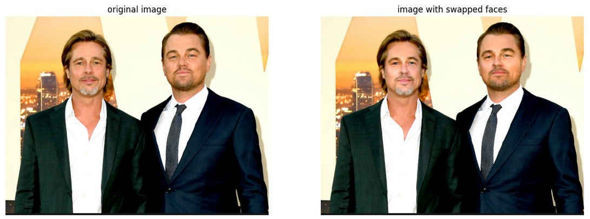

# Face Swapping
Swapping faces in input images, in python using OpenCV library, Mediapipe face landmarks detection modules, and other tools.

The main task of this project is to swap two faces in a single image.
For simplicity, we first apply face of a source image, to a destination image. 

Here are __the key steps__ that should be taken for face swapping:
1. Face Alignment: This step involves aligning the faces in the two pictures to ensure that the features match up correctly.
2. Facial Landmark Detection: Facial landmark detection is used to identify key points on the face, such as the eyes, nose, and mouth, which helps in accurately mapping the features for swapping.
3. Convex Hull: Convex hull is used to create a boundary around the facial landmarks, which aids in defining the face's shape and structure.
4. Delaunay Triangulation: Delaunay triangulation is applied to divide the convex hull into triangles, allowing for more precise warping and blending of the faces.
5. Warping: Warping involves deforming one face to match the shape and structure of the other face, ensuring a seamless transition between the two.
6. Seamless Cloning: Seamless cloning is the final step, which involves blending and color-correcting the face swap to make it look as natural as possible.

__Two approaches__ have been demonstrated in this project, first using hand-defined face landmarks and triangulation,  
and the second utilizing the Mediapipe's face landmarks and mesh detectors.

__The first approach__ for face swapping utilizes several functions to achieve its goal. Here's an overview of the functions used in the code:
1. readPoints(path): This function reads landmark points from a text file.
2. applyAffineTransform(src, srcTri, dstTri, size): It applies an affine transform calculated using source and destination triangles to the source image and outputs an image of a specified size.
3. rectContains(rect, point): This function checks if a point is inside a rectangle.
4. calculateDelaunayTriangles(rect, points): It calculates the Delaunay triangles based on the given rectangle and points.
5. warpTriangle(img1, img2, t1, t2): This function warps and alpha blends triangular regions from two images to produce a final image.

__The second approach__ uses Mediapipe for landmark detection and mesh creating. It also defines functions for the steps mentioned at the begining.
1. get_landmark_points(src_image): This function uses MediaPipe's FaceMesh to detect facial landmarks in the source image. It returns the landmark points as a list of (x, y) coordinates.
2. extract_index_nparray(nparray): This function extracts an index from a NumPy array and returns it. It seems to be used to extract indices from NumPy arrays. 
3. get_triangles(convexhull, landmarks_points, np_points): This function performs Delaunay triangulation on the facial landmarks to divide the face into triangles. It returns the indices of the triangles.
4. triangulation(triangle_index, landmark_points, img=None): This function takes a triangle index, landmark points, and an optional image. It calculates the bounding rectangle of the triangle, creates a mask for the triangle, and returns the points, cropped triangle, cropped triangle mask, and the rectangle.
5. warp_triangle(rect, points1, points2, src_cropped_triangle, dest_cropped_triangle_mask): This function warps a triangle from the source image to the destination image based on the corresponding points and masks.
6. add_piece_of_new_face(new_face, rect, warped_triangle): This function adds the warped triangle of the new face to the destination image based on the rectangle and the triangle.
7. swap_new_face(dest_image, dest_image_gray, dest_convexHull, new_face): This function swaps the new face with the destination image using masks and blending techniques. It returns the resulting image.
8. set_src_image(image): This function initializes various variables related to the source image, such as the grayscale image, mask, landmark points, convex hull, and triangles indices.

The code then reads two images, and uses these functions to complete the face swapping task.

A __real-time face swapping__ has also been implemented using this second approach.

  
you can observe a sample reluts in the image below:  
  

Finally, for the main task, which has been to swap faces in a single image we do the following steps:
1. Face Detection: Use a face detection model, such as the HaarCascade algorithm, to detect and obtain bounding boxes for the faces in the image.
2. Face Cropping: Crop the detected faces using the obtained bounding boxes and save them as new variables.
3. Face Swapping: Set the first face as the source image and apply it to the second face as the destination. Then, set the second face as the source and apply it to the first face as the destination.
4. Replace Faces: Replace the main faces in the original image with the results obtained from the face swapping process.

Done !  
  
  
  

with help from:
1. https://learnopencv.com/face-swap-using-opencv-c-python/
2. Mediapipe demos: face landmark detection modules
3. https://youtu.be/gthvlYTAuqI?si=f3LfMqKlU75wamsg  
